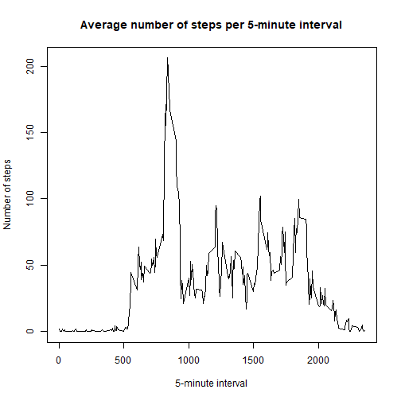
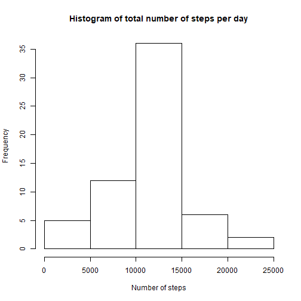
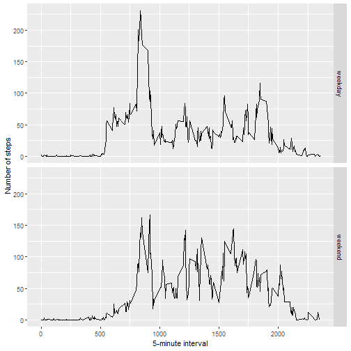

**Load the data:**


```r
mydata <- read.csv("activity.csv")
```

**Calculate the total number of steps taken per day:**


```r
total_day <- tapply(mydata$steps, mydata$date, sum)
```

**Make histogram of the total number of steps taken each day:**


```r
hist(total_day, xlab = "Number of steps", main = "Histogram of total number of steps per day")
```


**Calculate and report the mean and median of the total number of steps taken per day:**


```r
mean_steps <- mean(total_day, na.rm=TRUE)
median_steps <- median(total_day, na.rm=TRUE)
```

The mean number of total steps taken per day is 1.0766189 &times; 10<sup>4</sup> and the median is 10765.

**Make a time series plot of the 5-minute interval and the average number of steps taken, averaged across all days:**

```r
ave_steps_int <- as.data.frame(tapply(mydata$steps, mydata$interval, mean, na.rm=TRUE))
ave_steps_int <- cbind(ave_steps_int, mydata[1:288, 3])
colnames(ave_steps_int) <- c("ave.steps", "interval")
plot(ave_steps_int$interval, ave_steps_int$ave.steps, type="l", xlab="5-minute interval", ylab="Number of steps", main = "Average number of steps per 5-minute interval")
```



**Which 5-minute interval contains the maximum number of steps on average across all days?**

```r
x <- ave_steps_int[ave_steps_int$ave.steps == max(ave_steps_int$ave.steps), ]
```

The 5-minute interval with the maximum number of steps on average across all days is 835.


**Calculate the total number of missing values in the dataset:**

```r
total.NA <- sum(is.na(mydata$steps)) + sum(is.na(mydata$date)) + sum(is.na(mydata$interval))
```

There are 2304 missing values in the dataset.

**Devise a strategy for filling in all of the missing values in the dataset.**

I will fill in the missing values with the mean for that particular 5-minute interval.

**Create a new dataset that is equal to the original dataset but with the missing data filled in.**

```r
library(dplyr)

# I created a new dataset that merged the original dataset with the average steps by interval dataset.
mydata_fill <- merge(mydata, ave_steps_int, by.y = "interval")

# if there's a missing value, I replace it with the average number of steps for that interval.
for (i in 1:nrow(mydata_fill)) 
  {if(is.na(mydata_fill[i,2]) == TRUE) {mydata_fill[i,2] = mydata_fill[i, 4]}}

# remove the extra column from this new dataset
mydata_fill <- select(mydata_fill, steps, date, interval)

# rearrange the new dataset like the original one
mydata_fill <- arrange(mydata_fill, date, interval)
```

**Make a histogram of the total number of steps taken each day and Calculate and report the mean and median total number of steps taken per day. Do these values differ from the estimates from the first part of the assignment? What is the impact of imputing missing data on the estimates of the total daily number of steps?**


```r
total_day_fill <- tapply(mydata_fill$steps, mydata_fill$date, sum)
hist(total_day_fill, xlab = "Number of steps", main = "Histogram of total number of steps per day")
```



```r
mean_steps_fill <- mean(total_day_fill, na.rm=TRUE)
median_steps_fill <- median(total_day_fill, na.rm=TRUE)
```

Imputing the missing data with this method did not change the mean total daily number of steps, but increased the median by 1.1886792.

**Create a new factor variable in the dataset with two levels - "weekday" and "weekend" indicating whether a given date is a weekday or weekend day.**

```r
mydata_fill$date <- as.Date(mydata_fill$date)
wd <- vector()
for (i in 1:nrow(mydata_fill)) {
  if(weekdays(mydata_fill[i,2]) == "Saturday" | weekdays(mydata_fill[i,2]) == "Sunday") {wd[i] = "weekend"} else {wd[i] = "weekday"}}
# combine wd with the dataset
mydata_fill <- cbind(mydata_fill, wd)
```

**Make a panel plot containing a time series plot of the 5-minute interval (x-axis) and the average number of steps taken, averaged across all weekday days or weekend days (y-axis).**

```r
ave_steps_wd <- aggregate(mydata_fill$steps, by = list(mydata_fill$wd, mydata_fill$interval), mean, na.rm=TRUE)
names(ave_steps_wd) <- c("wd", "interval", "mean.steps")
library(ggplot2)
ggplot(ave_steps_wd, aes(x=interval, y=mean.steps)) + xlab("5-minute interval") + ylab("Number of steps") + geom_line() + facet_grid(wd~.)
```


